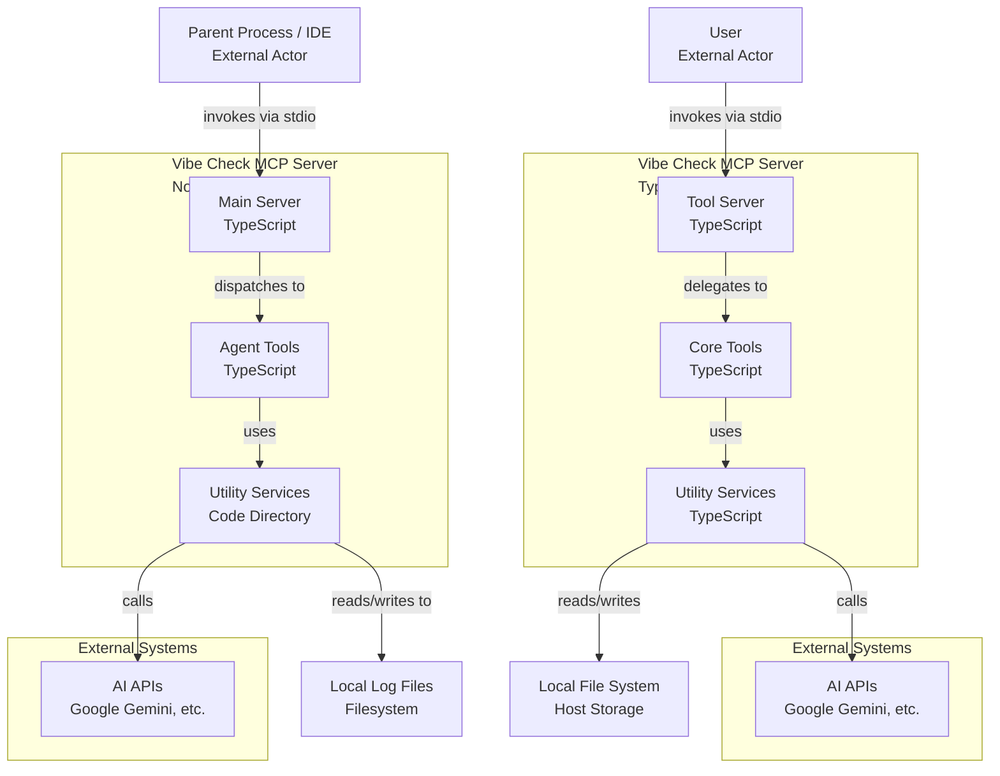

# 🧠 Vibe Check MCP Server


## 🚀 Project Overview

The `Vibe Check MCP Server` is a robust and extensible Model Context Protocol (MCP) server designed to provide advanced AI-driven tools for various tasks, including code analysis, planning, and mental model suggestions. Built with TypeScript, it integrates seamlessly with external AI systems to offer context-aware and actionable insights.

_Your AI's inner rubber duck when it can't rubber duck itself._

## What is Vibe Check?

In the **"vibe coding"** era, AI agents now have incredible capabilities, but the question has now moved:

from
> "Can my AI agent really do this **complex task**?"

to

> "Can my AI agent understand that I want to write a **simple program**, not an _infrastructure for a multi-billion dollar tech company_?"

It provides the essential "Hold up... this ain't it" moment that AI agents don't currently have: a built in self-correcting oversight layer. It's the definitive Vibe Coder's sanity check MCP server:

- Prevent cascading errors in AI workflows by implementing strategic pattern interrupts.
- Uses tool call "Vibe Check" with Gemini 2.5 Pro (Gemini API), fine-tuned for pedagogy and metacognition to enhance complex workflow strategy, and prevents tunnel vision errors.
- Implements "Vibe Distill" to encourage plan simplification, prevent over-engineering solutions, and minimize contextual drift in agents.
- Self-improving feedback loops: Agents can log mistakes into "Vibe Learn" to improve semantic recall and help the oversight AI target patterns over time.
- **Vibe Planning Tool**: Generates step-by-step plans for achieving goals, considering historical mistakes and extracted concerns from thinking logs.
- This tool allows agents to break down complex goals into actionable steps, taking into account historical mistakes and extracted concerns from thinking logs.
- Its main use is to break down complex goals into actionable steps, or to reframe goals into more achievable steps.
- It can also be used to generate plans for achieving goals, considering historical mistakes and extracted concerns from thinking logs.
- This allows agent to see the big picture, instead of getting lost in the details.
  - **Context-Aware Planning**: Utilizes `src/utils/context-parser.ts` to parse thinking logs and extract potential concerns, integrating them into risk assessment for more robust plans.
  - **Historical Mistake Consideration**: Leverages `src/utils/storage.ts` to fetch and incorporate insights from past mistakes, guiding future planning to avoid recurring issues.
- **Vibe Mental Models Tool**: Provides actionable mental model suggestions based on user queries and context.
- This tool allows agents to use mental models to understand and apply mental models to their work.
- It can also be used to generate mental models for achieving goals, considering historical mistakes and extracted concerns from thinking logs.
- This can help agents adapt to new situations and avoid common pitfalls.
  - **Enhanced Suggestions**: Integrates `src/utils/context-parser.ts` to analyze thinking logs and inform mental model suggestions, making them more relevant and personalized.
  - **Mistake-Driven Insights**: Utilizes `src/utils/storage.ts` to analyze historical mistakes and offer targeted mental model suggestions based on mistake categories.
  - **Context-Aware Insights**: Integrates `src/utils/context-parser.ts` to analyze thinking logs and inform mental model suggestions, making them more relevant and personalized.
  - **Historical Mistake Consideration**: Leverages `src/utils/storage.ts` to fetch and incorporate insights from past mistakes, guiding future planning to avoid recurring issues.

**TLDR; Implement an agent fine-tuned to stop your agent and make it reconsider before it confidently implements something wrong.**

## The Problem: Pattern Inertia

In the vibe coding movement, we're all using LLMs to generate, refactor, and debug our code. But these models have a critical flaw: once they start down a reasoning path, they'll keep going even when the path is clearly wrong.

```txt
You: "Parse this CSV file"

AI: "First, let's implement a custom lexer/parser combination that can handle arbitrary 
     CSV dialects with an extensible architecture for future file formats..."

You: *stares at 200 lines of code when you just needed to read 10 rows*
```

This **pattern inertia** leads to:

- 🔄 **Tunnel vision**: Your agent gets stuck in one approach, unable to see alternatives
- 📈 **Scope creep**: Simple tasks gradually evolve into enterprise-scale solutions
- 🔌 **Overengineering**: Adding layers of abstraction to problems that don't need them
- 📊 **Overthinking**: Your agent spends too much time reasoning about a problem, unable to see the bigger picture
- ❓ **Misalignment**: Solving an adjacent but different problem than the one you asked for
- 🤔 **Misunderstanding**: Misinterpreting the user's intent or requirements
- 🤯 **Miscommunication**: Miscommunication between the user and the agent

## Features: Metacognitive Oversight Tools

Vibe Check adds a metacognitive layer to your agent workflows with three integrated tools:

### 🛑 vibe_check

**Pattern interrupt mechanism** that breaks tunnel vision with metacognitive questioning:

```javascript
vibe_check({
  "phase": "planning",           // planning, implementation, or review
  "userRequest": "...",          // FULL original user request 
  "plan": "...",                 // Current plan or thinking
  "confidence": 0.7              // Optional: 0-1 confidence level
})
```

### ⚓ vibe_distill

**Meta-thinking anchor point** that recalibrates complex workflows:

```javascript
vibe_distill({
  "plan": "...",                 // Detailed plan to simplify
  "userRequest": "..."           // FULL original user request
})
```

### 🔄 vibe_learn

**Self-improving feedback loop** that builds pattern recognition over time:

```javascript
vibe_learn({
  "mistake": "...",              // One-sentence description of mistake
  "category": "...",             // From standard categories
  "solution": "..."              // How it was corrected
})
```

### 🧠 vibe_mental_models

**Mental model suggestion tool** that provides actionable mental model suggestions based on user queries and context. It enhances suggestions by:

```javascript
vibe_mental_models({
  "query": "...",                // The query for the mental models tool (e.g., 'explain first principles', 'suggest mental models')
  "context": "..."               // Optional context for the mental models query
})
```

### 🗺️ vibe_planning

**Step-by-step planning tool** that breaks down complex goals into actionable steps:

```javascript
vibe_planning({
  "goal": "...",                 // The goal to plan for
  "context": "...",              // Optional context for the planning
  "constraints": "...",          // Optional constraints for the planning
  "thinkingBudget": 10,          // Optional: controls reasoning depth if handled by server
})
```

## ✨ New Tools and Integrations

In addition to the core metacognitive oversight tools, Vibe Check MCP Server now includes advanced tools for planning and mental model suggestions, leveraging sophisticated context parsing and historical data storage.

### Vibe Mental Models

The `vibe_mental_models` tool provides actionable mental model suggestions based on user queries and context. It enhances suggestions by:

- **Context-Aware Insights**: Integrates `src/utils/context-parser.ts` to analyze thinking logs and inform mental model suggestions, making them more relevant and personalized.
- **Mistake-Driven Guidance**: Utilizes `src/utils/storage.ts` to analyze historical mistakes and offer targeted mental model suggestions based on mistake categories, helping agents learn from past errors.

### Vibe Planning

The `vibe_planning` tool generates step-by-step plans for achieving goals, incorporating historical mistakes and extracted concerns from thinking logs. Key enhancements include:

- **Risk-Aware Planning**: Leverages `src/utils/context-parser.ts` to parse thinking logs and extract potential concerns, integrating them into risk assessment for more robust and resilient plans.
- **Historical Learning**: Fetches and incorporates insights from past mistakes using `src/utils/storage.ts`, guiding future planning to avoid recurring issues and improve strategic decision-making.

### Vibe Check in Action

**Before Vibe Check:**


_Claude assumes the meaning of MCP despite ambiguity, leading to all subsequent steps having this wrong assumption_

**After Vibe Check:**


_Vibe Check MCP is called, and points out the ambiguity, which forces Claude to acknowledge this lack of information and proactively address it_

## Installation & Setup

### Installing via Smithery

To install vibe-check-mcp-server for Claude Desktop automatically via [Smithery](https://smithery.ai/server/@PV-Bhat/vibe-check-mcp-server):

```bash
npx -y @smithery/cli install @PV-Bhat/vibe-check-mcp-server --client claude
```

### Manual Installation via npm (Recommended)

```bash
# Clone the repo
git clone https://github.com/PV-Bhat/vibe-check-mcp-server.git
cd vibe-check-mcp-server

# Install dependencies
npm install

# Build the project
npm run build

# Start the server
npm run start
```

## Integration with Claude

Add to your `claude_desktop_config.json`:

```json
"vibe-check": {
  "command": "node",
  "args": [
    "/path/to/vibe-check-mcp/build/index.js"
  ],
  "env": {
    "GEMINI_API_KEY": "YOUR_GEMINI_API_KEY"
  }
}
```

## Environment Configuration

Create a `.env` file in the project root:

```bash
GEMINI_API_KEY=your_gemini_api_key_here
```

## Agent Prompting Guide

For effective pattern interrupts, include these instructions in your system prompt:

```bash
As an autonomous agent, you will:

1. Treat vibe_check as a critical pattern interrupt mechanism
2. ALWAYS include the complete user request with each call
3. Specify the current phase (planning/implementation/review)
4. Use vibe_distill as a recalibration anchor when complexity increases
5. Build the feedback loop with vibe_learn to record resolved issues
```

## When to Use Each Tool

| Tool | When to Use |
|------|-------------|
| 🛑 **vibe_check** | When your agent starts explaining blockchain fundamentals for a todo app |
| ⚓ **vibe_distill** | When your agent's plan has more nested bullet points than your entire tech spec |
| 🔄 **vibe_learn** | After you've manually steered your agent back from the complexity abyss |
| 🧠 **vibe_mental_models** | When your agent needs to understand and apply mental models |
| 🗺️ **vibe_planning** | When your agent needs to generate a step-by-step plan for achieving a goal |

## API Reference

See the [Technical Reference](./docs/technical-reference.md) for complete API documentation.

## Architecture

<details>
<summary><b>The Metacognitive Architecture (Click to Expand)</b></summary>

Vibe Check implements a dual-layer metacognitive architecture based on recursive oversight principles. Key insights:

1. **Pattern Inertia Resistance**: LLM agents naturally demonstrate a momentum-like property in their reasoning paths, requiring external intervention to redirect.

2. **Phase-Resonant Interrupts**: Metacognitive questioning must align with the agent's current phase (planning/implementation/review) to achieve maximum corrective impact.

3. **Authority Structure Integration**: Agents must be explicitly prompted to treat external metacognitive feedback as high-priority interrupts rather than optional suggestions.

4. **Anchor Compression Mechanisms**: Complex reasoning flows must be distilled into minimal anchor chains to serve as effective recalibration points.

5. **Recursive Feedback Loops**: All observed missteps must be stored and leveraged to build longitudinal failure models that improve interrupt efficacy.

6. **Context-Aware Planning**: Leverages `src/utils/context-parser.ts` to parse thinking logs and extract potential concerns, integrating them into risk assessment for more robust plans.

7. **Historical Mistake Consideration**: Leverages `src/utils/storage.ts` to fetch and incorporate insights from past mistakes, guiding future planning to avoid recurring issues.

8. **Mental Model Integration**: Leverages `src/utils/context-parser.ts` to parse thinking logs and extract potential concerns, integrating them into risk assessment for more robust plans.

For more details on the underlying design principles, see [Philosophy](./docs/philosophy.md).
</details>

## Vibe Check in Action (Continued)


---


---


---


## Verifications




## Documentation

| Document | Description |
|----------|-------------|
| [Agent Prompting Strategies](./docs/agent-prompting.md) | Detailed techniques for agent integration |
| [Advanced Integration](./docs/advanced-integration.md) | Feedback chaining, confidence levels, and more |
| [Technical Reference](./docs/technical-reference.md) | Complete API documentation |
| [Philosophy](./docs/philosophy.md) | The deeper AI alignment principles behind Vibe Check |
| [Case Studies](./docs/case-studies.md) | Real-world examples of Vibe Check in action |

## Contributing

We welcome contributions to Vibe Check! Whether it's bug fixes, feature additions, or just improving documentation, check out our [Contributing Guidelines](./CONTRIBUTING.md) to get started.

## License

[MIT](LICENSE)
